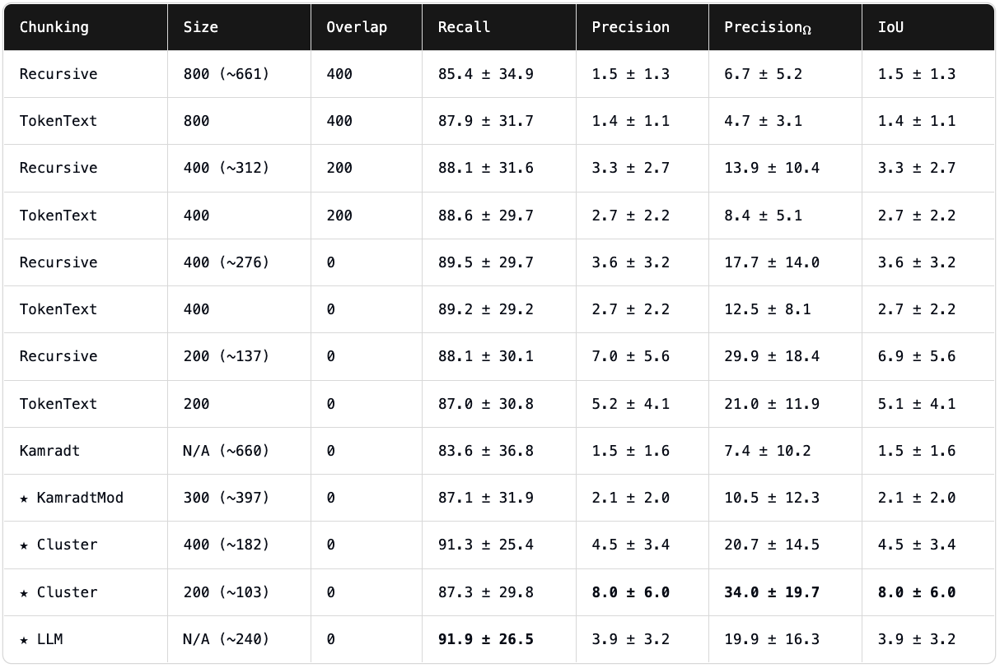

# Evaluating Domain Specific RAG Chunking & Embedding Strategies

The first step of creating RAG systems, choosing how to load and split your documents, is an often overlooked yet critical step. Recent research from [ChromaDB](https://trychroma.com) titled [Evaluating Chunking Strategies for Retrieval](https://research.trychroma.com/evaluating-chunking) outlines various popular chunking approaches and a few novel ideas to help give a good direction of choosing your chunking strategy.

Their main findings while using `text-embedding-3-large` from OpenAI:
1. The **Cluster Semantic Chunker** with a 200 token chunk size achieves the highest precision, precision with perfect recall, and intersection over union.
2. The **LLM Chunker** achieves the highest recall.
3. The **Recursive Character Text Splitter** with chunk size 200 achieves consistently high metrics and is a good lightweight option.

I've broken down how each one of these chunking strategies works [in a prior notebook](https://github.com/ALucek/chunking-strategies) using their [respective repo](https://github.com/brandonstarxel/chunking_evaluation). On top of the different chunking implementations, Chroma provided their evaluation framework that allows you to run tests both on a standard and domain specific documents to determine what chunking and embedding method might be the best for your specific application. While following the research data is a useful start, running your own experiments can help you find exactly what works best for you.

We'll be covering the four main approaches to:

1. Create Custom Chunking Strategies
2. Evaluate Custom & Existing Chunking Strategies
3. Evaluate Custom & Existing Embedding Strategies
4. Create a Synthetic Dataset for Domain Specific Evaluations
